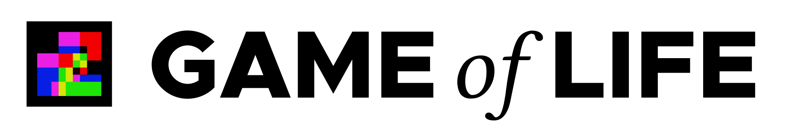

This repository contains our implementation of the first JIMP2 project - John Conway's Game of Life in C.

## Let's start with a pretty animation designed to lure you in

Isn't the above image pretty? The GIF was created using some random website, but the PNGs used to create that GIF came from our **Wonderful Piece of Software**.

## Progress tracking
For info about progress, go to [the project board](https://github.com/JIMP-HNKS/P1-Life/projects/1).

## Authors
* [Hubert Nakielski](https://github.com/nakielsh)
* [Kacper Seredyn](https://github.com/scintilla4evr)