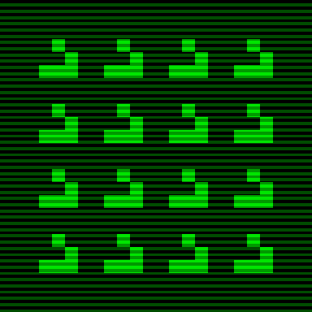

### Sprawozdanie z projektu The Game of Life

## Działanie

## 1. Opis tematyki projektu

## 2. Opis struktury projektu
Projekt podzielony jest na 11 plików:  
8 plików źródłowych: `fileio.c` `friends.c` `generate.c` `helper.c` `life.c` `main.c` `pathutils.c` `pngout.c`  
2 pliki nagłówkowe: `life.h` `overkill.h`  
1 Makefile: `Makefile`  
## 3. Parametry wywołania programu

# Opcje:
    -n  LICZBA_GENERACJI
        Ilość generacji gry do wygenerowania

        LICZBA_GENERACJI = 0 nie stworzy nowych generacji,
        a da na wyjściu plik PNG obecnej generacji.
        LICZBA_GENERACJI > 0 stworzy nowe generacje.
        LICZBA_GENERACJI < 0 nie jest dozwolona.

    -file PLIK_WEJŚCIOWY
        Stan początkowy.

    -out KATALOG_WYJŚCIOWY (opcjonalny)
        Katalog, do którego pliki wyjściowe będą zapisywane.

    -wrap (opcjonalne)
        Krawędzie będą się zawijały tworząc tablicę bez granic.

# Opcje PNG:
    -png-circles (opcjonalny)
        Tworzy okrągłe komórki w plikach wyjściowych PNG.

    -png-size ROZMIAR (opcjonalny)
        Ustawia rozmiar komórek w plikach wyjciowych PNG.
        Musi być większy niż 0. Domyślnie ustawione na 1.

    -png-overkill PLIK_OVK (opcjonalny)

## 4. Szczegóły implementacyjne

## 5. Testowanie programu i wyniki

## 6. Wnioski i spostrzeżenia

## Autorzy
* [Hubert Nakielski](https://github.com/nakielsh)
* [Kacper Seredyn](https://github.com/scintilla4evr)